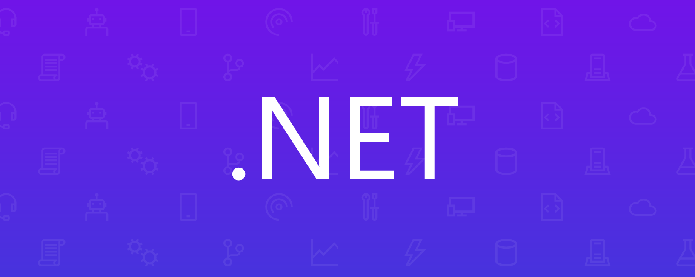

# NEMURA BACK-END API



## Project Description
This project was made with the proposity of create one ativities manager. Developed with C# using AspNetCore and being linked to a database provided by Clever Cloud.

> [!IMPORTANT]
> This API forms the basis of the Nemura platform, allowing connections between the back-end and front-end.

## Features

- **Project Management**: Performs CRUD operations on project records.
- **Gestión de Asignaciones**: Performs CRUD operations on assignment records.
- **Authentication and Authorization**: Secure JWT-based authentication.
- **Swagger Documentation**: Access the full API documentation and perform interactive tests through the Swagger UI.

## Project Diagrams

- **LINK**: https://drive.google.com/drive/folders/1AsLtRq17xbcTIBz2lOZwhCxZ_0YsLIJd?usp=drive_link

## Technologies Required

- .NET 8.0 
- MySQL
- Docker

## Setup and Installation

1. **Clonar el Repositorio**
   ```bash
   git clone 
2. **Navigate to the Project Directory**
   ```bash
   cd NemuraProject
4. **Restore Dependencies**
   ```bash
   dotnet restore
5. **Apply Migration**
   ```bash
   dotnet ef database update
6. **Run the App**
   ```bash
   dotnet run

## Contributions
Feel free to submit issues, extraction requests or suggestions. For details on contributions, see the project guidelines.

## Contact
For any questions or queries, please contact samuvv2905@gmail.com